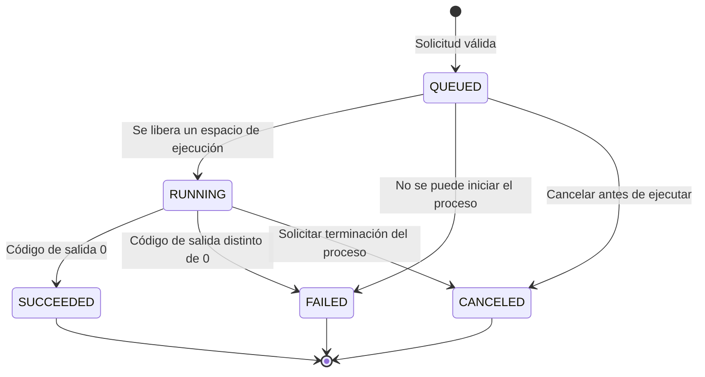

# Modelo de estados de los trabajos (RF-06)

Este documento describe los estados implementados en BeanRunner para el Hito 1
y distingue las funciones futuras que todavía no tienen persistencia.

## Estados implementados

| Estado | Tipo | Significado | Transición |
|---|---|---|---|
| `QUEUED` | Inicial / espera | El comando se validó y espera un espacio de ejecución. | Envío válido o espera detrás del límite de concurrencia. |
| `RUNNING` | Activo | El proceso hijo fue iniciado y se está supervisando. | El proceso terminó o se solicitó su cancelación. |
| `SUCCEEDED` | Terminal | El proceso terminó correctamente. | Código de salida igual a `0`. |
| `FAILED` | Terminal | El proceso terminó con error o no pudo iniciarse. | Código de salida distinto de `0` o error de lanzamiento. |
| `CANCELED` | Terminal | Se canceló un trabajo en cola o se terminó su proceso hijo activo. | Cancelación solicitada por el usuario o al cerrar la CLI. |

Cada trabajo en memoria conserva su ID, comando, estado, timestamps, PID si se
inició el proceso, código de salida y `stdout`/`stderr`. Los resultados se
pierden al cerrar la aplicación: la persistencia y recuperación no forman parte
de la implementación actual.

## Diagrama de transición implementado

## Invariantes

1. Solo las solicitudes válidas crean un trabajo.
2. Cada trabajo tiene un ID único y comienza en `QUEUED`.
3. El número de procesos activos no supera `max_concurrency` (por defecto 3).
4. El proceso se ejecuta sin shell implícito y sus flujos se recolectan por
   separado.
5. Un trabajo terminado registra `finished_at` y, si se inició un proceso, su
   código de salida.
6. Los estados terminales implementados son `SUCCEEDED`, `FAILED` y
   `CANCELED`.

## Recuperación futura

`INTERRUPTED` se propuso para reconocer trabajos que estuvieran ejecutándose
durante el reinicio o caída del daemon. No forma parte del enum ni del flujo
actual: no hay daemon persistente ni recuperación de historial todavía. Se
deberá añadir junto con la persistencia (RF-12/RF-13), no reportar como
funcionalidad ya implementada.
