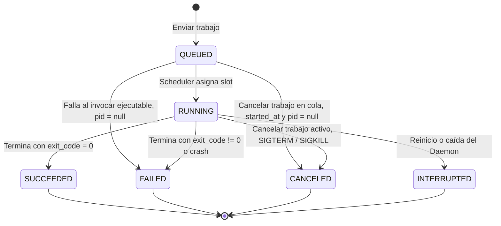

# Modelo Preliminar de Estados (RF-06)

Este documento describe la máquina de estados y las invariantes del ciclo de vida de los trabajos en **JobRunner**. Cada trabajo nace en `QUEUED`, puede pasar por `RUNNING` y termina en exactamente un estado terminal.

## 1. Definición de Estados

| Estado | Tipo | Qué significa | Cuándo ocurre | Metadatos registrados |
| :--- | :--- | :--- | :--- | :--- |
| **`QUEUED`** | Inicial | El trabajo fue validado y aceptado; espera un slot libre. | Al enviar un comando válido. | `id`, `command`, `created_at`, `status` |
| **`RUNNING`** | Activo | El proceso se está ejecutando en el sistema operativo (`fork`/`Popen`). | Cuando el scheduler asigna un slot y el proceso se instancia correctamente. | `started_at`, `pid`, `status` |
| **`SUCCEEDED`** | Terminal | El proceso terminó por sí solo y sin errores. | `exit_code == 0`. | `finished_at`, `exit_code` (0), `stdout`, `stderr` |
| **`FAILED`** | Terminal | El trabajo terminó con error o no pudo iniciarse. | Desde `RUNNING`: `exit_code != 0` o crash. Desde `QUEUED`: falla al invocar el ejecutable (no existe, `EACCES` o comando malformado en `fork`/`exec`). | `finished_at`, `exit_code`, `error_message`, `stderr`.  Si falla desde `QUEUED`: `pid = null`, `started_at = null`. |
| **`CANCELED`** | Terminal | El usuario detuvo el trabajo antes de que terminara. | Solicitud `cancel`, en cola o en ejecución (en ejecución usa señales POSIX). | `finished_at`, `exit_code`/señal, `canceled_at`.  Si se cancela desde `QUEUED`: `started_at = null`, `pid = null`, porque el proceso nunca se instanció. |
| **`INTERRUPTED`** | Terminal | El trabajo estaba en ejecución cuando el Daemon se reinició o cayó. | Detección al recuperar el servicio. | `finished_at`, `error_message` |

> **Tipos de estado:** *Inicial* = punto de entrada · *Activo* = en curso, puede cambiar · *Terminal* = final, no admite más transiciones.

---

## 2. Diagrama de Transición de Estados

---

## 3. Matriz de Transiciones

| Estado origen | Disparador | Condición | Estado destino | Requisito |
| :--- | :--- | :--- | :--- | :--- |
| — | Solicitud CLI/API | Comando válido | `QUEUED` | RF-01, RF-02, RF-03 |
| `QUEUED` | Slot libre | Trabajos activos < `max_concurrency` | `RUNNING` | RF-04, RF-05 |
| `QUEUED` | Slot libre | Falla en `fork`/`exec`: ejecutable inexistente, sin permisos (`EACCES`) o comando malformado | `FAILED` (`pid = null`, con `error_message`) | RF-04, RF-29 |
| `QUEUED` | Solicitud `cancel` | Trabajo aún en cola | `CANCELED` (`started_at = null`, `pid = null`) | RF-10 |
| `RUNNING` | Proceso finaliza | `exit_code == 0` | `SUCCEEDED` | RF-06, RF-07, RF-11 |
| `RUNNING` | Proceso finaliza | `exit_code != 0` | `FAILED` | RF-06, RF-07, RF-29 |
| `RUNNING` | Solicitud `cancel` | Proceso activo | `CANCELED` | RF-10, RF-30 |
| `RUNNING` | Reinicio del Daemon | Recuperación tras caída | `INTERRUPTED` | RF-13, RNF-10, RNF-31 |

---

## 4. Invariantes del Ciclo de Vida

1. Todo trabajo inicia en `QUEUED`; no existe otra forma de crearlo.
2. Los estados terminales (`SUCCEEDED`, `FAILED`, `CANCELED`, `INTERRUPTED`) son definitivos: no hay transiciones de salida.
3. Un trabajo está en un solo estado a la vez.
4. Solo los trabajos en `RUNNING` tienen un proceso activo, y su cantidad nunca excede `max_concurrency`.
5. `started_at` y `pid` solo existen si el proceso llegó a instanciarse. Un trabajo que pasa de `QUEUED` a `FAILED` (falla de invocación) o a `CANCELED` (cancelación en cola) conserva ambos en `null`/`None`.
6. Todo estado terminal registra `finished_at`.
7. Una falla de invocación (`fork`/`exec`) nunca pasa por `RUNNING`: va directo de `QUEUED` a `FAILED` con su `error_message`.